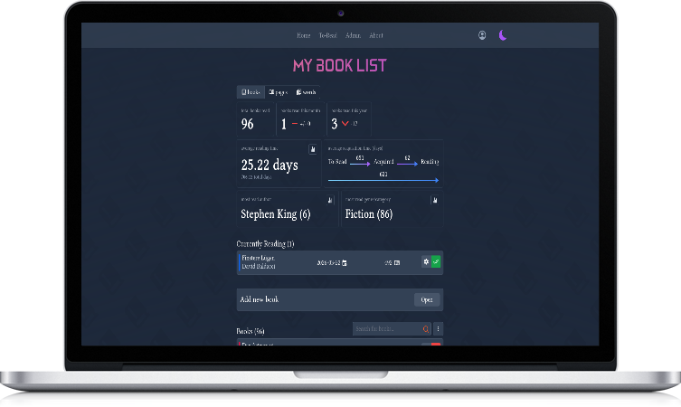

# svelte book store

A personal book tracking app focused on your reading activity, habits and progress, rather than social interaction.

  

## Features

- statistics about books/pages/words per year, month, day, etc
  - average reading time, time from to-read to started, etc
  - most read authors, categories
- tracking of reading activity (to-read, reading, finished, did not finish, paused, acquired)
- sortable and filterable book list, quick actions
- privacy settings (private, public, authenticated users)
- open registration and closed with invite links
- google books api integration for easy adding of books
- crude account management (no password reset, email verification, etc)

## Installation

You can either use a docker image or build from source.
However, to configure the app, you first have to create `.env.production` file similar to `env.example`.
Make sure to:

- follow the format of the example file and fill in the values
- not use quotes around the values as they are sometimes taken literally.

This will then initially create your admin account.

### Docker

Run one of:

- `./run-book-store.sh`

- `docker run -it  -d --env-file .env.production -v book-store:/database -p 4000:3000 --name book-store ghcr.io/gaareth/svelte-books`

- `docker compose up -d`

### Source

1. `git clone https://github.com/Gaareth/svelte-books`
2. `npm ci`.
3. `npx prisma generate`
4. `npx prisma migrate deploy`.
5. `npm run build`.
6. `node build`

#### Development

1. `git clone https://github.com/Gaareth/svelte-books`
2. `npm install`
3. `npx prisma generate`
4. `npx prisma migrate dev`
5. `npm run dev`

If you changed the schema and want to test it:

- `npx prisma db push`: To try out the changes without creating a migration
- `npx prisma migrate dev --name <migration_name>`: To create a new migration file

## Todos

- upgrade to svelte5, tailwind4, vite8?, etc...
- when adding new reading activity, if there is already an active one, ask if they want to transform the active one to the new status (e.g., from to-read to reading)

- reading time relative to book length

- shelves

- google books api throttling and caching, per user

- color bar, similar color for similar books

  - revisit some time

- more finegrained privacy/visibility settings:

  - private books

- tension stats draw yourself - check

  - let user add more graphs

- add or remove google api

- update googleapi values

  - especially categories

- crud for lists

- statistics page
- books read over time or github like graph
- per month, year, day etc
- min/avg/max time for started reading to finished.

  - similarly for to-read to started! or finished?
  - avg time from to-read to acquired

- did i fix them already?

  - fix last month selector when is january?
  - fix optionaldate unique

- reading activity icons?
- acquired -> reading, maybe only count if book was wanted (ie. was in to-read)

- rework dark mode colors, more consistent styles

# Tech-Stack

- SvelteKit
- Prisma
- Docker
- TypeScript
- Tailwind
