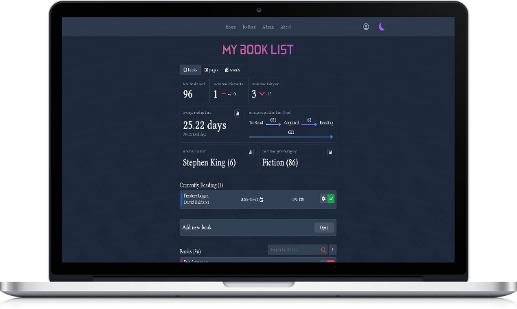

# svelte book store

A personal book tracking app focused on your reading activity, habits and progress, rather than social interaction.

  

## Features

- statistics about books/pages/words per year, month, day, etc
    - average reading time, time from to-read to started, etc
    - most read authors, categories
- tracking of reading activity (to-read, reading, finished, did not finish, paused, acquired)
- sortable and filterable book list, quick actions
- privacy settings (private, public, authenticated users)
- optional dates, when you can only remember the year you read a book
- open registration and closed with invite links
- google books api integration for easy adding of books and metadata
- crude account management (no password reset, email verification, etc)

## Installation

1. `mkdir book-store`
2. Configure the app: create `.env.production` file similar to `env.example`.
   Make sure to:

- follow the format of the example file and fill in the values
- not use quotes around the values as they are sometimes taken literally.

    This will initially create your admin account.

3. You can then either use a docker image or build from source.

### Docker

1. Get the docker compose file: `wget https://raw.githubusercontent.com/Gaareth/svelte-books/main/docker-compose.yml`
2. Run it (edit it to change e.g. ports): `docker compose up -d`

### Source

- (requires a [Node.js](https://nodejs.org/en/) `node` installation. Use e.g. [nvm](https://github.com/nvm-sh/nvm) to install node version 24)

1. `git clone https://github.com/Gaareth/svelte-books`
2. `pnpm install --frozen-lockfile`.
3. `pnpm exec prisma generate`
4. `pnpm exec prisma migrate deploy`.
5. `pnpm run build`.
6. `node build`

#### Development

1. `git clone https://github.com/Gaareth/svelte-books`
2. `pn install`
3. `pn prisma generate`
4. `pn prisma migrate dev`
5. `pn run dev`

If you changed the schema and want to test it:

- `pn prisma db push`: To try out the changes without creating a migration
- `pn prisma migrate dev --name <migration_name>`: To create a new migration file

## Todos

- SUB
- simple? cache for showing google book images
- better google books search
    - a default search result of both title and author and just title combined
    - a custom seach bar with intitle, inauthor etc as styled tags (ideally not editable)

- browser tests
- more no-javascript friendly
- just implement auth myself, authjs is a crazy mess
    - OIDC
- configurable? median stats

- upgrade tailwind, zod
    - dateselector

- when adding new reading activity, if there is already an active one, ask if they want to transform the active one to the new status (e.g., from to-read to reading)

- reading time relative to book length

- takeover: choose what to takeover (pages, title, cover, isbn, ...)

- shelves

- google books api throttling and caching, per user
    - dont use backend to query google books api? optionally
    - custom api key

- color bar, similar color for similar books

    - revisit some time

- more finegrained privacy/visibility settings:

    - private books

- tension stats draw yourself - check

    - let user add more graphs

- update googleapi values

    - especially categories

- crud for lists

- statistics page
- books read over time or github like graph
- per month, year, day etc
- min/avg/max time for started reading to finished.

    - similarly for to-read to started! or finished?
    - avg time from to-read to acquired

- did i fix them already?

    - fix last month selector when is january?
    - fix optionaldate unique

- reading activity icons?
- acquired -> reading, maybe only count if book was wanted (ie. was in to-read)

- rework dark mode colors, more consistent styles
- violet-400 as accent color

- other ORM? maybe TypeOrm?, MikroOrm

# Tech-Stack

- SvelteKit
- Prisma
- Docker
- TypeScript
- Tailwind
